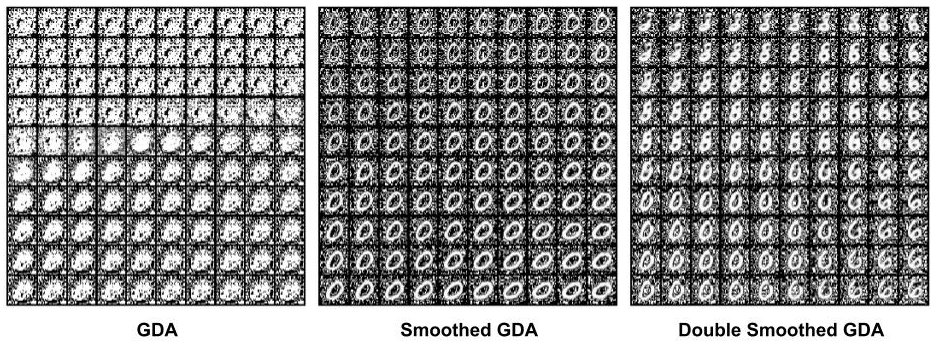
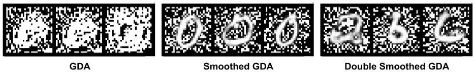
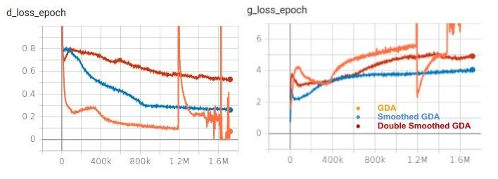

# Smoothed Gradient Descent-Ascent - PyTorch

- This repository contains an implementation of the algorithm presented in the paper ["A Single-Loop Smoothed Gradient Descent-Ascent Algorithm for Nonconvex-Concave Min-Max Problems"](https://arxiv.org/abs/2010.15768) (NeurIPS 2020)

- This repository applies the algorithm to a Vanilla GAN on MNIST dataset.
- The algorithm roughly translates to using:
  - Stochastic Weight Averaging (SWA) on the discriminator ("slower-moving" discriminator).
  - And a penalty on the Discriminator loss that forces the discriminator to not stray too far away from the SWA version of the Discriminator.
- The above algorithm, Smoothed Gradient Descent-Ascent (SGDA) is implemented at `SGDA.py`

- This repository also contains an extension of the SGDA algorithm which passes gradients from `both Discriminators` to the `Generator`.
- This change in the algorithm roughly translates to:
  - Minimizing Log-likelihood w.r.t to the SWA version of the Discriminator (in addition to the "faster-moving" discriminator)
- The above algorithm, "Double" Smoothed Gradient Descent-Ascent is implemented at `DoubleSmoothedGDA.py`

## Results

### DCGAN - MNIST

#### Latent Space Interpolation.

- Notice Vanilla GDA and SGDA both suffer from `Mode Collapse`.
- Double Smoothed GDA leads to a very rich latent space.
- To reach this level of Mutual Information (MI) between Latent vector and Generated Images, usually InfoMax like additional penalty term is needed.

#### Samples

- Again, SGDA suffers from `Mode Collapse`, while in GDA the `Discriminator` is fooled too easily by the `Generator`, hence the poorer results.
- To solve both problems, Wasserstein version of the GAN coupled with InfoMax might be needed.
- Double SGDA doesn't need anything special to avoid `Mode Collapse`.

### Loss Curves

- NOTE: Loss magnitudes are not comparable since all three methods use different loss functions.
- NOTE: These curves are only meant to intrepret the stability of losses of `Generator` and `Discriminator`.

### To-do

- [ ] Experiments on CelebA

### Shameless Plug

The experiments were conducted using the tool ["Poor Man's Job Scheduler"](https://github.com/ojus1/PoorMansJobScheduler). TLDR:

- pmrun "python3 foo.py"
- Run Asynchronous jobs on remote/local server as if they were your local machine.
- Without directly messing with SSH.
- Ignore files to sync with a `.gitignore`-style file.
